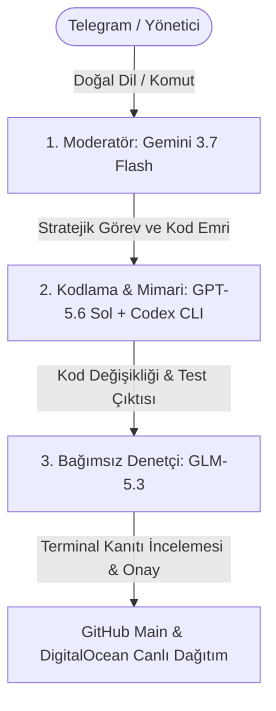
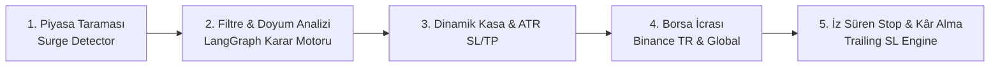

# 🦊 FOX-KRİPTO: OTONOM TİCARET SÜREÇLERİ VE SİSTEM REHBERİ

Bu belge, **Fox-Kripto 7/24 Otonom Kripto Ticaret ve Yapay Zeka Portföy Yönetim Sistemi**'nin mimarisini, karar süreçlerini, borsa entegrasyonlarını ve operasyonel takip adımlarını detaylandırmak üzere hazırlanmıştır.

---

## 📑 İÇİNDEKİLER
1. [Sistem Mimarisi ve Çoklu Ajan Heyeti (3-Tier Council)](#1-sistem-mimarisi-ve-çoklu-ajan-heyeti)
2. [Uçtan Uca Otonom Al-Sat Süreci (Trading Lifecycle)](#2-uçtan-uca-otonom-al-sat-süreci)
3. [Dinamik Strateji ve Risk Profilleri (Preset Manager)](#3-dinamik-strateji-ve-risk-profilleri)
4. [Borsa ve Cüzdan Mimarisi (Çift Borsa)](#4-borsa-ve-cüzdan-mimarisi)
5. [Telegram Komut ve Etkileşim Rehberi](#5-telegram-komut-ve-etkileşim-rehberi)
6. [Veritabanı ve Ledger Hafızası (Supabase)](#6-veritabanı-ve-ledger-hafızası)
7. [Güvenlik ve Sunucu Altyapısı](#7-güvenlik-ve-sunucu-altyapısı)
8. [Canlı Sistem Durum Tablosu](#8-canlı-sistem-durum-tablosu)

---

## 1. 🏗️ Sistem Mimarisi ve Çoklu Ajan Heyeti

Sistem, tek bir modelin halüsinasyon görmesini engellemek ve kurallara %100 sadık kalmak amacıyla **3 Kademeli Çoklu Ajan Heyeti (Multi-Agent Council)** tarafından yönetilir:

* **1. Moderatör (`google/gemini-3.7-flash`):** Telegram sohbetini analiz eder, kullanıcı niyetini kavrar, gereksiz kod değişikliklerini engeller ve teknik görevleri yönlendirir.
* **2. Kodlama & Mimari (`openai/gpt-5.6-sol` + Codex CLI):** Dosyaları düzenler, terminal testlerini koşar ve somut terminal çıktısı üretir.
* **3. Bağımsız Denetçi (`z-ai/glm-5.3`):** Kod diff'lerini, terminal çalıştırma kanıtlarını ve güvenlik kurallarını inceler; terminal kanıtı olmayan hiçbir işlemi onaylamaz.

---

## 2. ⚡ Uçtan Uca Otonom Al-Sat Süreci

Otonom motor arka planda kesintisiz olarak şu 5 aşamalı döngüyü çalıştırır:

### Aşama 1: Piyasa Taraması (Surge Detector)
* Tüm Binance Global (USDT) ve Binance TR (TRY/USDT) tahtaları milisaniyeler içinde taranır.
* **Hacim Patlaması (Volume Spike):** Son 5 dakikadaki hacmin geçmiş ortalamaya oranı (`>= 1.3x`).
* **Erken Koşu İvmesi:** Fiyatın son 5 dakikada `%0.8` ile `%7.0` arasında dipten ivmelenmesi.

### Aşama 2: Güvenlik ve Doyum Filtreleri (LangGraph)
1. **Pre-Pump Filtresi:** Son 24 saatte `+%15.0` üzerinde primlenmiş tepe coinlere FOMO alımı engellenir.
2. **Tahta Doyum Oranı (Orderbook Depth):** Anlık alış/satış derinliği incelenir. Satıcılar alıcıların 1.5 katından fazlaysa (`Alış/Satış < 0.65`) alım iptal edilir.
3. **Dinlenme Soğuması (Cooldown Lock):** Kâr veya zararla çıkılan bir pariteden hemen sonra tepe tuzağına düşmemek için 30 dakika alım yasağı uygulanır.
4. **Yapay Zeka Skoru:** Momentum, haber ve derinlik skorlarının bileşimi en az `5.0 / 10` olmak zorundadır.

### Aşama 3: Kasa Tahsisi ve Dinamik SL/TP (ATR-14)
* **Kasa Bölünmesi:** Serbest nakit slot sayısına bölünerek tahsis edilir (Örn: $50 kasa $\rightarrow$ $16.66 slot).
* **ATR Stop-Loss & Take-Profit:** Sabit oran yerine coinin 14 periyotluk volatilitesine göre dinamik Stop-Loss (`~%2.5`) ve Take-Profit (`~%5.0`) hesaplanır (Risk/Ödül Oranı $1:2$).

### Aşama 4: Borsa İcrası ve Çift Emir
* Spot Market Buy emri borsaya iletilir.
* Hemen ardından borsaya **Fiziksel Stop-Loss Limiti** kurulur.

### Aşama 5: Dinamik İz Süren Stop (Trailing Stop-Loss)
* Fiyat yükseldikçe stop seviyesi yukarı taşınır. Kâr tepeye vurduğunda geri çekilme olursa kâr kilitlenerek otomatik satılır.

---

## 3. 🎛️ Dinamik Strateji ve Risk Profilleri

Admin Paneli (`/admin`) üzerinden tek tıkla değiştirilebilen ve Supabase'e kalıcı olarak kaydedilen strateji modları:

| Profil Adı | Hacim Çarpanı | Min 5dk Hacim | 24s Tavan Prim | Min AI Skoru | Karakteristik |
| :--- | :---: | :---: | :---: | :---: | :--- |
| **🚀 21 Ağustos Çevik Mod (Aktif)** | **`1.3x`** | **`$8,000`** | **`+%15.0`** | **`5.0 / 10`** | Yüksek işlem sıklığı, dipten kalkan altcoinleri anında yakalama. |
| **🛡️ 22 Ağustos Defansif Mod** | **`1.8x`** | **`$25,000`** | **`+%8.5`** | **`6.0 / 10`** | Düşük işlem sıklığı, yalnızca devasa hacim patlamalarında giriş. |
| **⚙️ Özel Mod (Custom)** | *Serbest* | *Serbest* | *Serbest* | *Serbest* | Kullanıcının belirlediği özel risk parametreleri. |

---

## 4. 🏢 Borsa ve Cüzdan Mimarisi

* **🇹🇷 Binance TR:** Türk Lirası (`TRY`) ve `USDT` çiftlerinde yerel banka entegrasyonlu ve sıfır komisyonlu doğrudan işlem.
* **🌍 Binance Global:** Dünya çapında likidite ve tüm global altcoin tahtalarına anlık erişim.
* **🧪 Sanal İşlem (Paper Trading):** Gerçek borsa riski almadan canlı verilerle sanal test modu.

---

## 5. 📱 Telegram Komut ve Etkileşim Rehberi

Kullanıcılar `@FoxSystemBot` üzerinden doğal dille veya kısa komutlarla tüm sistemi yönetebilir:

* `durum` veya `bakiye` $\rightarrow$ Canlı çift borsa cüzdan özetini ve açık pozisyonları listeler.
* `analiz` $\rightarrow$ Küresel piyasayı ve anlık balina patlamalarını tarayıp rapor döner.
* `haberler` $\rightarrow$ En son küresel kripto piyasası ve zincir üstü haberleri getirir.
* `toz temizle` $\rightarrow$ $5 altındaki küçük küsuratları resmi SAPI ile anında BNB'ye dönüştürür.
* `[COIN] al` (Örn: `SPK al`, `10$ SOL al`, `500 TL BTC al`) $\rightarrow$ Doğrudan borsaya canlı alım emri iletir.
* `[COIN] sat` (Örn: `TUT sat`, `Elimdeki AVAX'ı sat`) $\rightarrow$ Açık pozisyonu anında piyasa fiyatından nakde çevirir.

---

## 6. 🗄️ Veritabanı ve Ledger Hafızası (Supabase)

Tüm durumlar Supabase PostgreSQL üzerinde atomik ve kalıcı olarak tutulur:
* `user_tenants`: Kullanıcı kimlikleri, borsa API anahtarları ve dil tercihleri.
* `crypto_agent_states`: Strateji konfigürasyonları (`system_strategy_config`), aktif pozisyonlar (`pos_...`) ve soğuma kilitleri.
* `crypto_trade_logs`: Alınan her işlemin infaz fiyatı, yapay zeka skoru, kâr/zarar yüzdesi ve borsa emir numaraları.

---

## 7. 🔒 Güvenlik ve Sunucu Altyapısı

* **DigitalOcean Canlı Sunucu (Egress IP):** `104.248.135.128`
* **Yerel Geliştirme IP'si:** `178.246.172.228`
* **API Güvenlik Standartları:**
  * Para Çekme (Withdrawal) yetkisi kesinlikle **KAPALIDIR**.
  * Yalnızca Okuma ve Spot Alım/Satım yetkisi kullanılır.
  * API anahtarları IP Whitelist korumasıyla 90 günlük süre kısıtlamasından muaftır.

---

## 8. 📊 Canlı Sistem Durum Tablosu

| Bileşen | Güncel Durum | Notlar |
| :--- | :---: | :--- |
| **Piyasa Tarama Motoru (Surge)** | 🟢 AKTİF | 1.3x Çevik Mod devrede |
| **Yapay Zeka Karar Grafı (LangGraph)** | 🟢 AKTİF | `dynamic_budget_pct` hatası giderildi |
| **Binance TR Bağlantısı** | 🟢 AKTİF | 172.00 USDT Serbest Nakit Hazır |
| **Binance Global Bağlantısı** | 🟢 AKTİF | Canlı emir infazı ve bakiye okuma çalışıyor |
| **Telegram Poller Servisi** | 🟢 AKTİF | Doğal dil ve hızlı komut yönlendirme devrede |
| **Dinamik Kâr Alma & İz Süren Stop** | 🟢 AKTİF | Açık pozisyonlar anlık takip ediliyor |

---
*Son Güncelleme: 24 Ağustos 2026 | Fox-Kripto Otonom Mühendislik Ekibi* 🦊⚡
